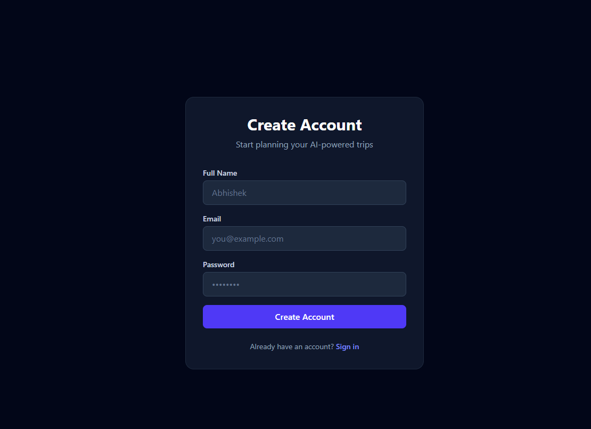
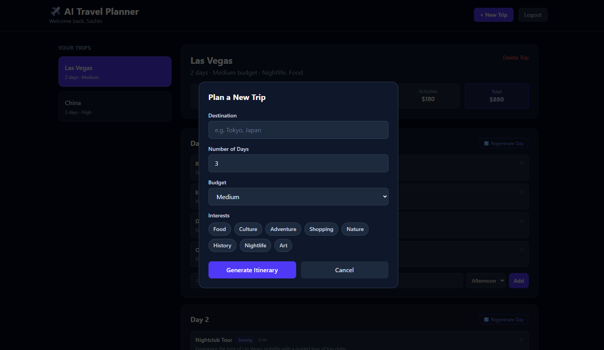
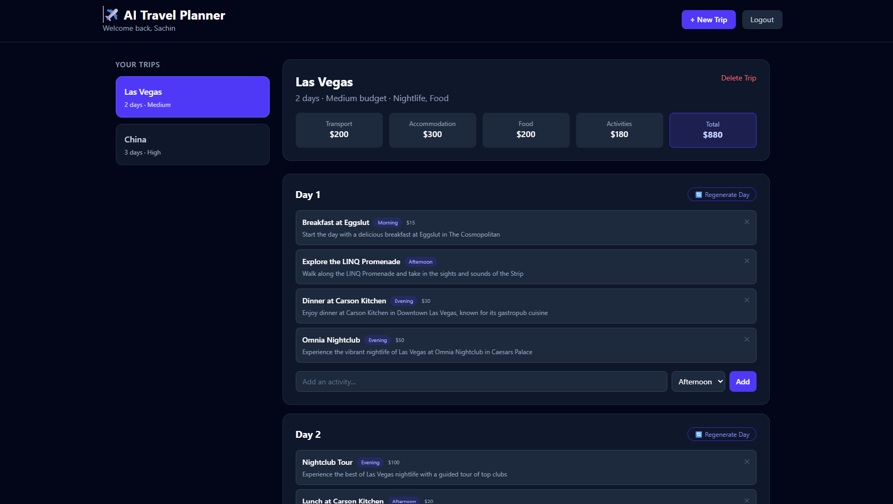
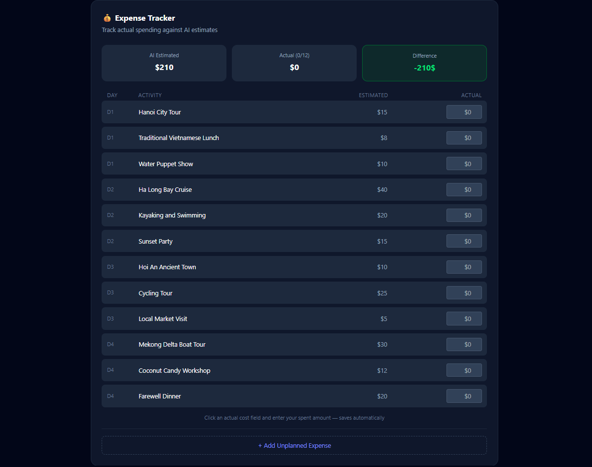

# AI Travel Planner

A production-deployed, multi-user full-stack web application that generates personalized travel itineraries using LLM integration. Built to demonstrate end-to-end full-stack engineering: authentication, database design, LLM integration, and cloud deployment.


## Live Demo
- **Frontend**: https://ai-travel-planner-three-nu.vercel.app
- **Backend**: https://ai-travel-planner-backend-al2x.onrender.com

## Screenshots 










## Tech Stack

| Layer | Technology | Reason |
|---|---|---|
| Frontend | Next.js 16 + Tailwind CSS | App Router for clean page-based routing, Tailwind for rapid responsive UI |
| Backend | Node.js + Express | Lightweight, fast REST API with strong ecosystem |
| Database | MongoDB + Mongoose | Flexible document model fits variable itinerary structures well |
| Auth | JWT + bcryptjs | Stateless auth scales well; bcrypt is the industry standard for password hashing |
| AI Agent | Groq API (Llama 3.3 70B) | Gemini API had provisioning issues on the free tier; Groq offers a free, fast, OpenAI-compatible alternative with structured JSON output support |

## Project Overview

Users register and log in to a personal dashboard where they can:
- Generate complete day-by-day travel itineraries using an LLM agent
- Get AI-estimated budgets broken down by transport, accommodation, food, and activities
- View hotel suggestions across budget tiers
- Edit itineraries — add activities, remove activities, or regenerate a specific day with custom instructions
- Track actual spending against AI estimates using the Expense Tracker

## Local Setup

### Prerequisites
- Node.js 18+
- MongoDB Atlas account
- Groq API key (free at console.groq.com)

### Backend
```bash
cd backend
npm install
```

Create a `.env` file in `backend/`:
```
PORT=5000
MONGO_URI=your_mongodb_connection_string
JWT_SECRET=your_random_secret_string
GROQ_API_KEY=your_groq_api_key
```

```bash
npm run dev
```

Backend runs on `http://localhost:5000`

### Frontend
```bash
cd frontend
npm install
npm run dev
```

Create a `.env.local` file in `frontend/`:

```
NEXT_PUBLIC_API_URL=http://localhost:5000
```

Frontend runs on `http://localhost:3000`

## Architecture

```
ai-travel-planner/
├── backend/
│   ├── config/db.js          # MongoDB connection
│   ├── middleware/auth.js    # JWT verification middleware
│   ├── models/
│   │   ├── User.js           # User schema
│   │   └── Trip.js           # Trip + itinerary schema
│   ├── controllers/
│   │   ├── authController.js # Register + login logic
│   │   └── tripController.js # Trip CRUD + AI generation
│   ├── routes/
│   │   ├── authRoutes.js
│   │   └── tripRoutes.js
│   ├── services/
│   │   └── aiService.js      # Groq API integration with exponential backoff
│   └── server.js
└── frontend/
    └── src/
        ├── app/
        │   ├── login/
        │   ├── register/
        │   └── dashboard/
        ├── components/
        │   ├── CreateTripForm.js
        │   ├── ItineraryView.js
        │   └── ExpenseTracker.js
        └── utils/api.js
```

## Authentication & Authorization 

- Passwords are hashed using `bcryptjs` before storage — plaintext passwords are never saved
- On login/register, a signed JWT is returned and stored in `localStorage`
- Every protected API route runs through `middleware/auth.js`, which verifies the JWT signature and attaches `req.user.id` to the request
- **Data isolation**: every database query on trips includes `userId: req.user.id` as a filter — users cannot access, modify, or delete another user's trips even if they know the trip ID

## AI Agent Design

The AI agent is implemented in `services/aiService.js` and uses the Groq API (Llama 3.3 70B model) for two operations:

**1. Full trip generation** (`POST /api/trips`)
The agent receives destination, duration, budget tier, and interests. A structured prompt forces JSON output matching the exact database schema — itinerary, hotels, and budget breakdown in one call. The response is parsed and saved directly to MongoDB.

**2. Day regeneration** (`POST /api/trips/:id/regenerate-day`)
A targeted prompt sends the existing day's activities alongside an optional user instruction (e.g. "more outdoor activities"). The agent returns a replacement activity list for just that day, preserving other days untouched.

Both operations use exponential backoff (1s → 2s → 4s → 8s → 16s) to handle transient API rate limits gracefully.

**Initially attempted integration with Gemini API, but the free tier returned persistent quota errors due to Google Cloud project provisioning restrictions. Rather than blocking on infrastructure setup, I switched to Groq — a pragmatic engineering decision. The AI service layer is provider-agnostic: the generateTripPlan function interface stays identical regardless of which LLM is behind it, making a future swap back to Gemini a one-file change.

## Expense Tracker

**What it does**: A dedicated section below each trip's itinerary lets users enter actual spending for each AI-suggested activity and compare it against the AI's estimates in real time. Users can also add unplanned expenses not in the itinerary.

**Why I built it**: AI-generated budgets are estimates — they're useful for planning but diverge from reality. This feature closes the loop: users can see exactly where the AI was accurate and where it over or underestimated. The comparison (estimated vs actual, with a color-coded difference indicator) gives travelers actionable insight during the trip itself.

**How it works**: `actualCostUSD` is stored alongside `estimatedCostUSD` on each activity in MongoDB. The frontend updates on blur (not on every keystroke) to minimize API calls. The summary recalculates totals in real time.

## Key Design Decisions & Trade-offs

**JWT in localStorage vs httpOnly cookies**: localStorage is simpler to implement and works well for this scope. The trade-off is XSS vulnerability — httpOnly cookies would be more secure in production.

**AI generation on trip creation vs separate step**: generating the itinerary immediately on form submission gives a better UX (one action → complete plan) at the cost of slower response time. A loading overlay communicates this wait to the user.

**Groq over Gemini**: documented above under AI Agent Design.

**Free tier deployment**: Render's free tier spins down after 15 minutes of inactivity. The first request after inactivity may take 30–60 seconds. A paid tier or a keep-alive ping would resolve this in production.

## Known Limitations & Future Improvements

- All budget estimates are in USD. Future: real-time currency conversion based on user locale
- Regenerate day replaces the full day rather than incrementally modifying it, due to LLM context limitations. Users wanting to add specific activities should use the manual Add Activity input
- Render free tier cold start delay (~30–60 seconds after inactivity)
- No email verification on registration
